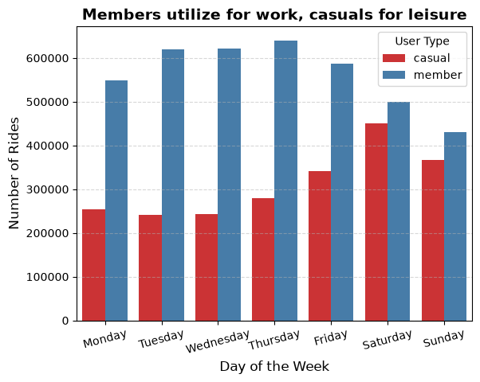
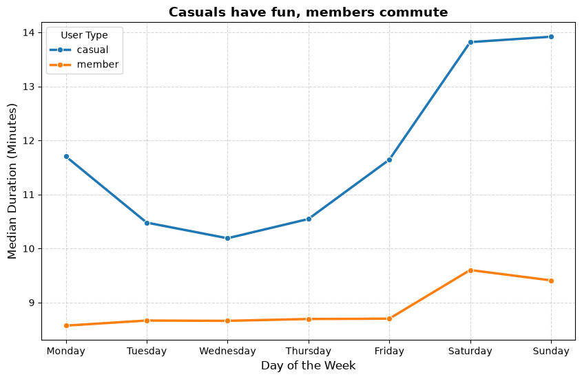
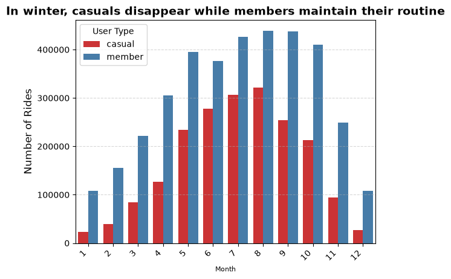
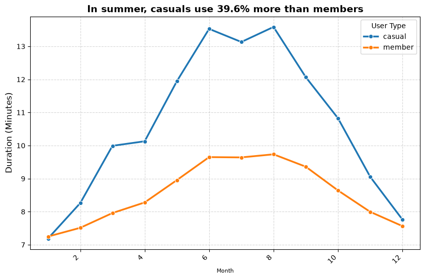
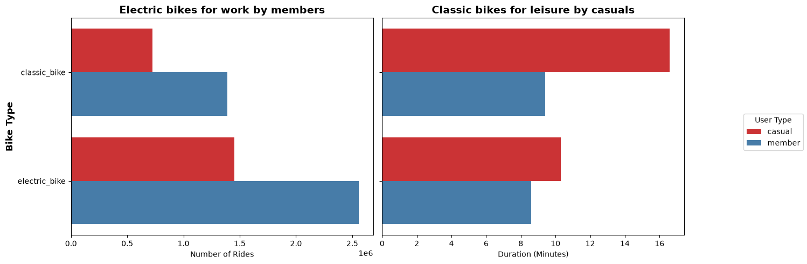

# Cyclistic Bike-Share Analysis
### How do annual members and casual riders use Cyclistic bikes differently?

> Google Data Analytics Professional Certificate — Capstone Project · Track A  
> Python · Pandas · Matplotlib · Seaborn · Jupyter Notebook

---

## Data Source & License

Trip data made available by **Motivate International Inc.**, operator of Chicago's public bike-share system, under license from the **City of Chicago**.

- **License:** [Divvy Data License Agreement](https://divvybikes.com/data-license-agreement)
- **Data access:** [divvy-tripdata.s3.amazonaws.com](https://divvy-tripdata.s3.amazonaws.com/index.html)
- **Note:** "Cyclistic" is a fictional company used in the Google Data Analytics Capstone. The analysis uses real public data for learning and portfolio purposes. Raw CSV files are not included here — see the license for terms.

---

## Table of Contents

1. [Introduction](#1-introduction)
2. [Prepare · Process · Analyze](#2-prepare--process--analyze)
3. [Recommendations](#3-recommendations)
4. [Conclusion](#4-conclusion)
5. [Next Steps](#5-next-steps)

---

## 1. Introduction

**Cyclistic** is a fictional bike-share service in Chicago with 5,800+ bikes and 692 stations. Riders can use it as **annual members** (subscription) or **casual riders** (day passes or single rides).

The marketing team wants to understand what drives the difference between the two groups and how to convert more casual riders into members. This analysis looks at 13 months of trip data to find out how they actually ride differently.

> *How do annual members and casual riders use Cyclistic bikes differently?*

**Dataset:** Jun/2025 – May/2026 · Source: Motivate International Inc. · **6,123,157 trips analyzed**

---

## 2. Prepare · Process · Analyze

### Prepare

Data comes straight from the operator — 13 monthly CSV files with trip-level records and no personal information. I could only analyze at the group level (member vs. casual), not per individual user.

**Issues found along the way:**

| Issue | What I did |
|---|---|
| File `202501` should be `202601` (Jan/2026) | Checked manually — dates inside were correct |
| `started_at` / `ended_at` stored as text | Converted to datetime |
| Trips under 90 seconds (unlock errors) | Removed — 228,003 rows |
| Null station names on electric bikes | Kept — electric bikes can park anywhere |

---

### Process

Used Python and Pandas to clean and enrich the data. Jupyter Notebook keeps everything reproducible.

| Step | What happened |
|---|---|
| Combined 13 CSVs | 6,351,159 rows |
| Removed coordinate columns | Not needed for this analysis |
| Converted timestamps | `str` → `datetime64` |
| Added time columns | date, month, day, year, day_of_week |
| Calculated trip duration | `travel_time` in seconds |
| Filtered short trips | −228,003 rows |
| **Final dataset** | **6,123,157 valid trips** |

---

### Analyze

`travel_time` has a strong right skew (mean 16.5 min vs. median 10.5 min), so I used the **median** throughout.

Three things stood out:

**1 — Members and casuals ride for completely different reasons**  
Members take short, consistent trips all week (~9 min) — commute behavior. Casuals ride mostly on weekends with trips 33% longer (~12 min) and more variable — leisure behavior.

**2 — Casuals basically disappear in winter**  
Casual volume drops 92% from summer to January. Members drop too (~75%), but they keep going because biking is already part of their routine. This means there's a clear window for conversion: summer.

**3 — The classic bike is the casual leisure product**  
Casual riders on classic bikes ride 77% longer than members on the same bike (16.6 min vs. 9.4 min). They're the most engaged segment in the casual group.

---

## 3. Recommendations

Three recommendations came directly out of the data:

---

### Recommendation 1 — Summer campaign at parks and tourist spots

Casual riders are already out biking on weekends and in summer. The idea is to catch them in those moments — at parks, trails, tourist spots — and show them what a membership actually means for their routine.

> *"You already love cycling. Make it your everyday routine."*

---

### Recommendation 2 — Discounted membership in summer

Casuals are most active in summer — that's the window. A discounted membership during Jun–Aug gives them a low-friction reason to commit. Someone who bikes through summer has already built the habit; they're more likely to keep the subscription even when it gets cold.

---

### Recommendation 3 — Focus on casual riders who use classic bikes

Classic bike casuals ride 77% longer than members. They're heavy users who just haven't subscribed. That makes them the easiest group to convert — they already have the habit, they just need the offer.

---

## 4. Conclusion

Members and casuals don't ride differently in how much — they ride differently in *why*. Members built biking into their commute. Casuals use it for weekend fun and summer rides.

The data is pretty clear on where to act: hit casuals in summer, at leisure spots, and prioritize the classic bike crowd. That's when and where they're most engaged — and most likely to convert.

---

## 5. Next Steps

| Action | Owner | When | Expected outcome |
|---|---|---|---|
| Summer campaign at parks and tourist spots | Marketing | May/Jun | More membership sign-ups among active casuals |
| Discounted summer membership launch | Product + Marketing | June | Convert casual riders at peak activity |
| Digital campaign targeting classic bike casuals | Marketing / CRM | Jun–Aug | Higher conversion from the most engaged casual segment |
| Survey: why don't frequent casuals subscribe? | Product research | Alongside campaign | Better segmentation for next cycle |

---

## Technical Details

| | |
|---|---|
| Full analysis | [`notebooks/cyclistic-capstone.ipynb`](notebooks/cyclistic-capstone.ipynb) |
| Language | Python 3 |
| Libraries | Pandas · Matplotlib · Seaborn · Glob |
| Period | Jun/2025 – May/2026 |
| Final dataset | 6,123,157 trips |
| Charts | [`output/`](output/) |

---

*Ricardo Borges — [LinkedIn](https://www.linkedin.com/in/ricardobamoraes/) · Google Data Analytics Certificate · 2026*
